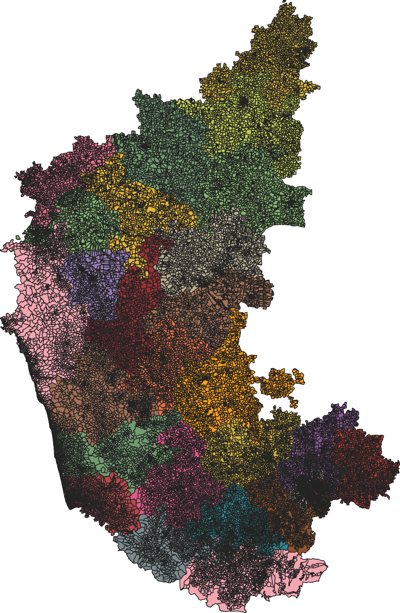

# India Polling Stations Geodata

### Source

Data on this repository has been scraped/sourced from:

- Karnataka: [KSRSAC](https://kgis.ksrsac.in/pollinginfo/) (July 2022)

### Data

Available in the following formats:

- GeoJSON (`.geojson`)
- KML (`.kml`)
- Shapefile (`.shp`)
- FlatGeobuf (`.fgb`): Only for state level data.
- PMTiles (`.pmtiles`): Only for state level data.

Available at the following administrative levels:
- State: On the [releases](https://github.com/Vonter/india-polling-stations/releases) page.
- District: In the repository under `data/district/`
- Lok Sabha Constituency: In the repository under `data/loksabha/`
- Assembly Constituency: In the repository under `data/assembly/`

### TODO

- Add scraping scripts
- More states
